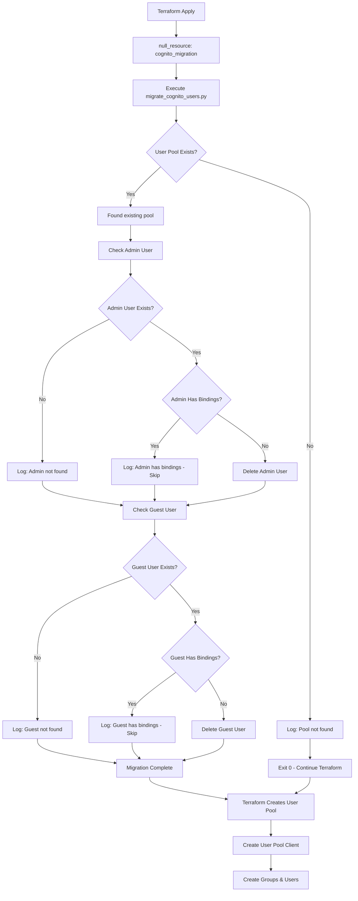
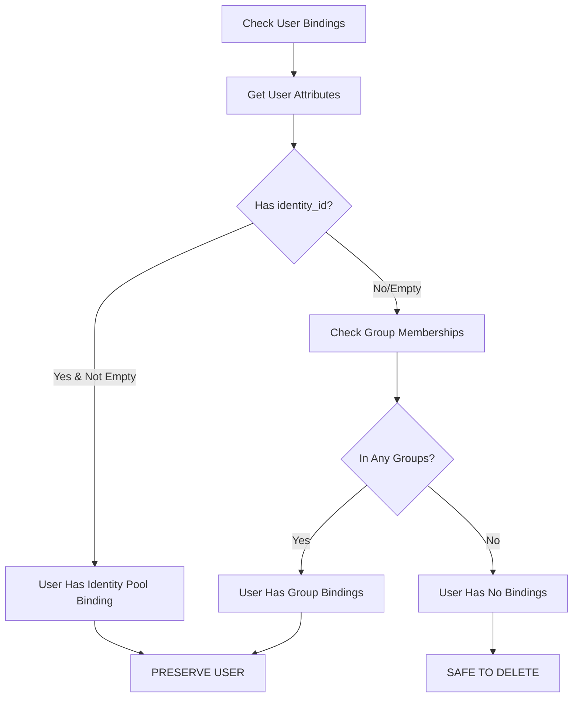
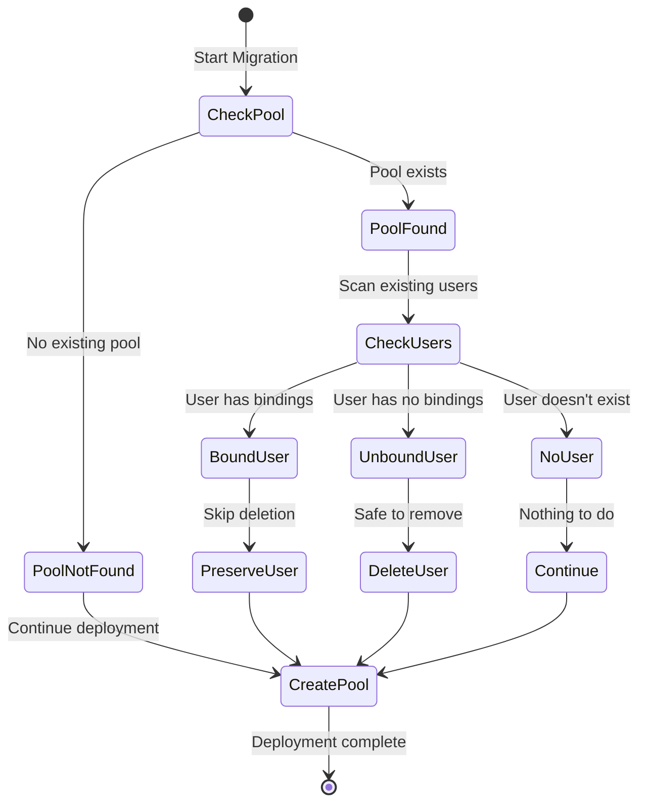
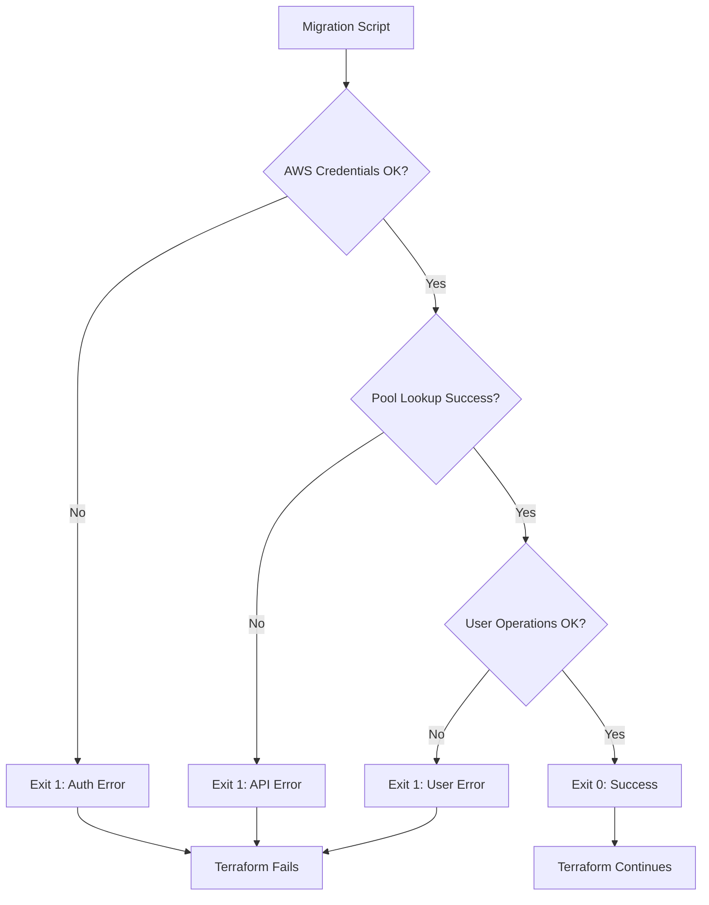

# Cognito Migration Process Diagram

## Migration Flow

**Purpose**: Shows the complete migration process from Terraform execution to resource creation.

**Key Points**:
- Migration runs automatically before Cognito resources are created
- Script safely handles both existing and non-existing user pools
- Users with AWS bindings are preserved, unbound users are deleted
- Process is idempotent - safe to run multiple times

## Binding Detection Logic

**Purpose**: Illustrates how the script determines if a user has AWS resource connections.

**Safety Checks**:
1. **Identity Pool Binding**: Users with `identity_id` attribute are connected to Cognito Identity Pool
2. **Group Membership**: Users in groups have role-based AWS permissions
3. **Decision**: Only users without any bindings are safe to delete

## Deployment States

**Purpose**: State diagram showing different user scenarios during migration.

**User Categories**:
- **Bound Users**: Have identity_id or group memberships → **PRESERVED**
- **Unbound Users**: No AWS connections → **SAFELY DELETED**
- **Non-existent Users**: Don't exist → **NO ACTION NEEDED**

**Outcome**: All paths lead to successful Terraform deployment

## Error Handling Flow

**Purpose**: Shows error scenarios and their impact on Terraform deployment.

**Error Types**:
- **Authentication Errors**: Invalid AWS credentials
- **API Errors**: Cognito service issues
- **User Operation Errors**: Permission or user-specific problems

**Behavior**: Any error causes migration to fail, which stops Terraform deployment for safety

## Summary

### Migration Process Overview
The Cognito migration system provides **idempotent Terraform deployments** by intelligently handling existing users before resource creation.

### Key Benefits
- ✅ **Zero Downtime**: Preserves users with active AWS connections
- ✅ **Safe Cleanup**: Removes only orphaned users without bindings
- ✅ **Automatic Execution**: Runs seamlessly during `terraform apply`
- ✅ **Error Safety**: Fails fast to prevent resource corruption

### Decision Matrix
| User State | Has identity_id | In Groups | Action |
|------------|----------------|-----------|--------|
| **Bound User** | ✅ Yes | Any | **PRESERVE** |
| **Bound User** | Any | ✅ Yes | **PRESERVE** |
| **Unbound User** | ❌ No | ❌ No | **DELETE** |
| **Missing User** | N/A | N/A | **CONTINUE** |

### Deployment Outcomes
- **First Deployment**: Creates fresh resources, handles any existing conflicts
- **Subsequent Deployments**: Maintains existing users with AWS connections
- **Failed Deployments**: Migration errors prevent resource corruption

### Best Practices
1. **Test First**: Use `./test_migration.sh` before production
2. **Monitor Logs**: Review migration output for skipped users
3. **Backup Strategy**: Export user data before major changes
4. **Rollback Plan**: Keep user exports for emergency restoration