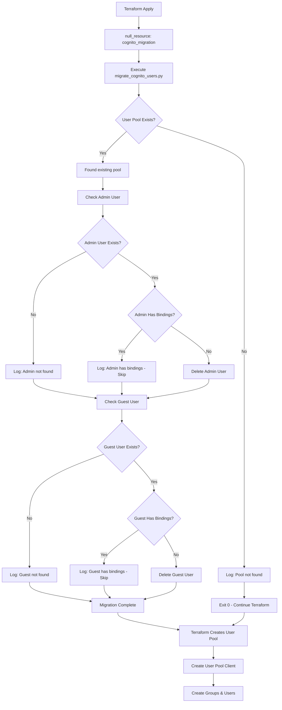
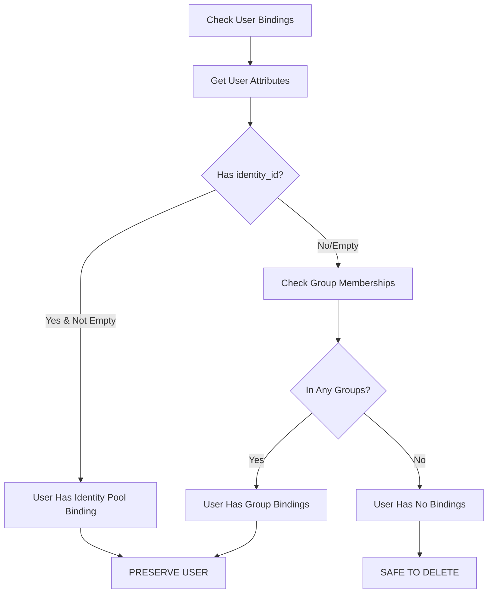
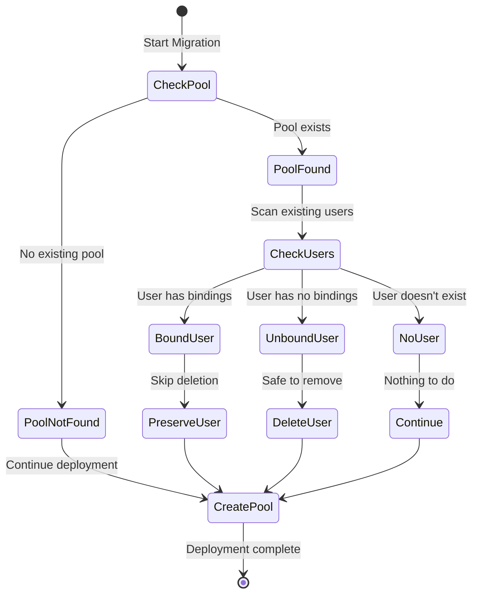
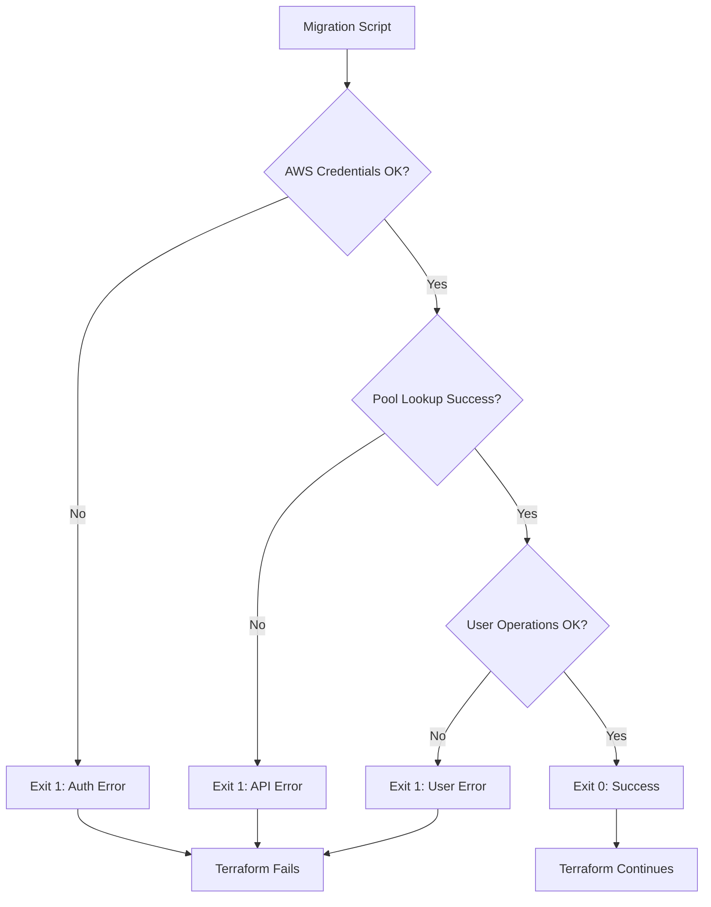

# Cognito Migration Process Diagram

## Migration Flow

```mermaid
flowchart TD
    A[Terraform Apply] --> B[null_resource: cognito_migration]
    B --> C[Execute migrate_cognito_users.py]
    C --> D{User Pool Exists?}
    
    D -->|No| E[Log: Pool not found]
    E --> F[Exit 0 - Continue Terraform]
    
    D -->|Yes| G[Found existing pool]
    G --> H[Check Admin User]
    H --> I{Admin User Exists?}
    
    I -->|No| J[Log: Admin not found]
    I -->|Yes| K{Admin Has Bindings?}
    
    K -->|Yes| L[Log: Admin has bindings - Skip]
    K -->|No| M[Delete Admin User]
    
    J --> N[Check Guest User]
    L --> N
    M --> N
    
    N --> O{Guest User Exists?}
    O -->|No| P[Log: Guest not found]
    O -->|Yes| Q{Guest Has Bindings?}
    
    Q -->|Yes| R[Log: Guest has bindings - Skip]
    Q -->|No| S[Delete Guest User]
    
    P --> T[Migration Complete]
    R --> T
    S --> T
    
    T --> U[Terraform Creates User Pool]
    U --> V[Create User Pool Client]
    V --> W[Create Groups & Users]
    
    F --> U
```

## Binding Detection Logic

```mermaid
flowchart TD
    A[Check User Bindings] --> B[Get User Attributes]
    B --> C{Has identity_id?}
    
    C -->|Yes & Not Empty| D[User Has Identity Pool Binding]
    C -->|No/Empty| E[Check Group Memberships]
    
    E --> F{In Any Groups?}
    F -->|Yes| G[User Has Group Bindings]
    F -->|No| H[User Has No Bindings]
    
    D --> I[PRESERVE USER]
    G --> I
    H --> J[SAFE TO DELETE]
```

## Deployment States

```mermaid
stateDiagram-v2
    [*] --> CheckPool: Start Migration
    
    CheckPool --> PoolNotFound: No existing pool
    CheckPool --> PoolFound: Pool exists
    
    PoolNotFound --> CreatePool: Continue deployment
    
    PoolFound --> CheckUsers: Scan existing users
    CheckUsers --> BoundUser: User has bindings
    CheckUsers --> UnboundUser: User has no bindings
    CheckUsers --> NoUser: User doesn't exist
    
    BoundUser --> PreserveUser: Skip deletion
    UnboundUser --> DeleteUser: Safe to remove
    NoUser --> Continue: Nothing to do
    
    PreserveUser --> CreatePool
    DeleteUser --> CreatePool
    Continue --> CreatePool
    
    CreatePool --> [*]: Deployment complete
```

## Error Handling Flow

```mermaid
flowchart TD
    A[Migration Script] --> B{AWS Credentials OK?}
    B -->|No| C[Exit 1: Auth Error]
    B -->|Yes| D{Pool Lookup Success?}
    
    D -->|No| E[Exit 1: API Error]
    D -->|Yes| F{User Operations OK?}
    
    F -->|No| G[Exit 1: User Error]
    F -->|Yes| H[Exit 0: Success]
    
    C --> I[Terraform Fails]
    E --> I
    G --> I
    H --> J[Terraform Continues]
```